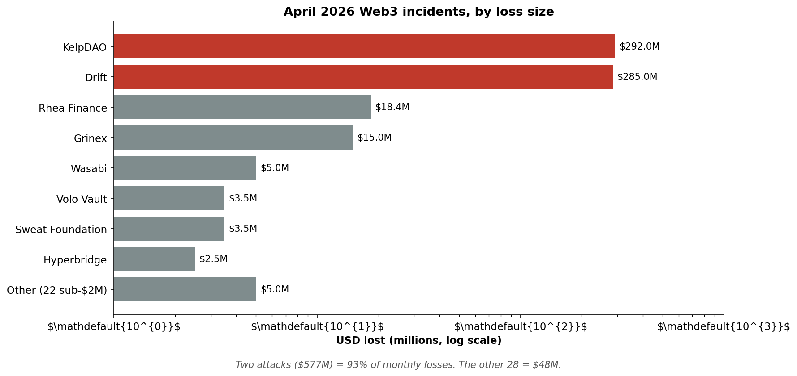
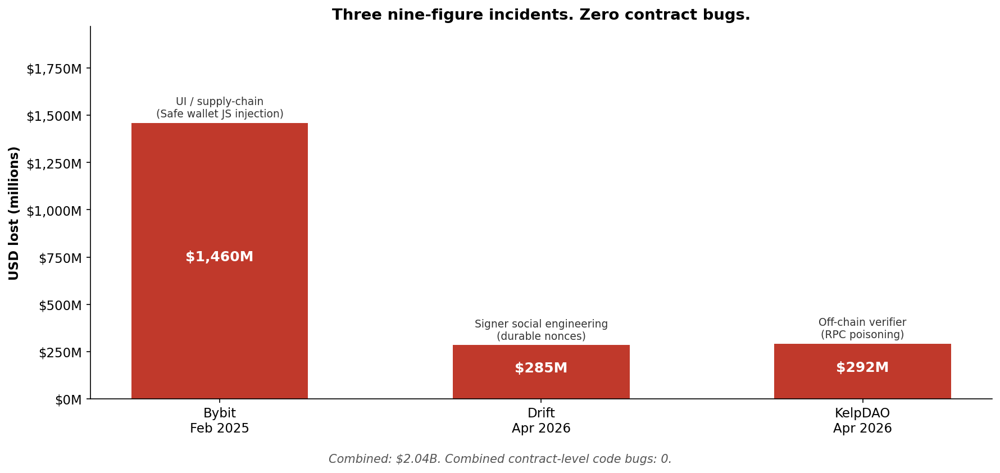
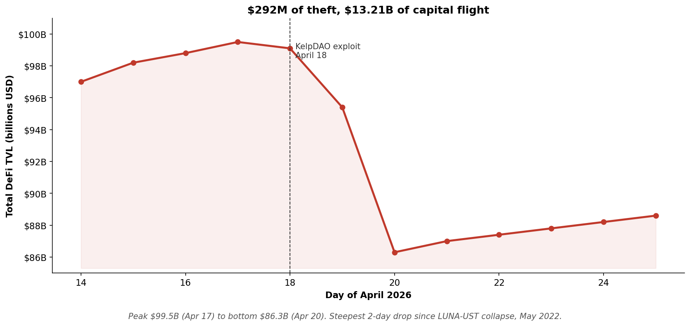

# Same Bug, New Victim

### A Forensic Read on Web3's $600M April

*Why the contract layer is no longer the perimeter.*

**By Ilan Rakhmanov**, Founder & CEO, ChainGPT Software
*Published: April 30, 2026*

---

## Prologue

In late March 2026, a senior engineer at Drift Protocol opened a Solana wallet to approve a routine governance transaction. The signing UI showed exactly what they expected. The signature verified cleanly. The transaction looked, by every available indicator, like the kind of thing they signed every other week.

Nine days later, on April 1 at 16:05 UTC, that signature transferred administrative control of a $285 million protocol to North Korean intelligence operatives. The drain that followed took ten seconds.

The contracts behaved correctly. The cryptography held. The audits had not missed anything. The signers had not been incompetent. The protocol failed because the entire defensive perimeter that the industry assumed was sufficient turned out, on inspection, to defend the wrong layer.

This is what 2026's largest Web3 attacks now look like.

---

## Executive Summary

April 2026 was the worst month for crypto theft since February 2025. Across roughly 30 distinct incidents, attackers extracted between $606 million and $650 million from Web3 protocols, depending on which tracker you trust. Two attacks, the Drift Protocol exploit on April 1 and the KelpDAO bridge exploit on April 18, accounted for about 93% of the month's losses. Both have been attributed by multiple independent investigators to North Korea's Lazarus Group.

The headline number is not, by itself, the most interesting fact. The interesting fact is what the two dominant attacks have in common with each other, and what they share with the long tail of smaller April incidents: almost none of them were the result of novel smart contract vulnerabilities. They were failures at the human, operational, and off-chain perimeter, exactly the layer that most existing security tooling does not monitor.

This is the recurrence problem, and it has shifted shape.

> **The contract layer is not the perimeter. It has not been the perimeter for at least 14 months.**

The full dataset of incidents analyzed here is published as [`data/incidents.csv`](data/incidents.csv) under CC BY 4.0. Charts referenced inline are in [`charts/`](charts/).

---

## 1. The Damage

The tracking community has not fully converged on a single April figure, which is itself worth noting:

- **CertiK:** $650.9M, the worst loss month since 2022.[^1]
- **PeckShield / DefiLlama:** $629.69M, with $614.17M attributable to DeFi protocols.[^2]
- **Phemex / Cyvers:** $606.2M across the first 18 days alone, 3.7× the entirety of Q1 2026 combined.[^3]
- **DefiLlama:** confirmed April 2026 as crypto's most-hacked month by incident count, with 30 separate events.[^4]

The discrepancy is methodology, not noise. Trackers differ on whether to include centralized-exchange theft, off-chain key compromise, and partially recovered funds. For our purposes, the working number is **~$625M across 30 incidents** (Drift, KelpDAO, plus 28 in the long tail), with the caveat that final numbers may shift as recoveries continue.

What this comes to in context: April 2026 alone was approximately 3.7× larger than all of Q1 2026 combined. The monthly losses of roughly $625M exceed the *annual* total losses of multiple prior years in DeFi's history. It is not an outlier in the sense of being random. It is an outlier in the sense of being structural.

The chart is what the prose cannot do quickly: two attacks dominate to the point of visual absurdity. KelpDAO and Drift between them account for $577M. The other 28 incidents combined account for roughly $48M.

---

## 2. Methodology

This piece aggregates incident data from five independent sources: DefiLlama Hacks, REKT News, PeckShield monthly reports, SlowMist HackedDB, and Chainalysis incident analyses, covering the period **April 1 to 30, 2026**. Where these sources disagree on a USD figure (which they often do, because of currency-conversion timing, recovery accounting, and inclusion criteria for partially-stolen funds), I report the range and identify the discrepancy explicitly. Where attribution is contested or preliminary, I report it as such.

**Inclusion criteria:**
- Loss ≥ $1M USD at the time of the incident
- Attack was external (not a rugpull, not an insider exit scam, not a governance attack via legitimate-but-malicious proposal)
- The funds moved on-chain (which excludes social-media-only scams and pure phishing without an on-chain transfer)

**Exclusions:**
- Centralized-exchange off-chain database compromises with no on-chain settlement
- Disputed incidents where two or more credible sources disagree on whether an attack actually occurred
- Sub-$1M incidents (the long tail below this threshold is large but not where the dollar weight is)

**Categorization:** Each incident was assigned a primary vulnerability class. The OWASP Smart Contract Top 10 (2025 edition)[^14] anchors the classification, extended with three additional categories (off-chain verifier compromise, signer social engineering, and UI/supply-chain compromise) that the OWASP taxonomy does not explicitly cover but which dominate the dollar-weighted total of recent incidents. The full classified dataset is at [`data/incidents.csv`](data/incidents.csv).

**Limitations:** This is a one-month sample from publicly disclosed sources. Undisclosed incidents (centralized custodians who quietly absorb losses, protocols that paid attacker bounties without public disclosure) are not captured. The total may understate true losses by an unknown but likely material amount. Twenty-two sub-$2M incidents are aggregated in the dataset rather than individually enumerated; the raw daily logs are at PeckShield and SlowMist HackedDB.

---

## 3. The Two Heists That Mattered

### 3.1 Drift Protocol, $285M (April 1, 2026)

Drift, a Solana-based perpetuals exchange, lost approximately $285 million in what SecurityWeek described as a ten-second drain.[^5] The technical mechanism is unusual enough to be worth understanding precisely.

Solana supports a feature called **durable nonces**, which allow a transaction to be signed at one moment and broadcast at any later moment without expiring. Standard Solana transactions expire when the recent blockhash they reference rolls off the 150-slot window, roughly 60 seconds under normal conditions. Durable-nonce transactions persist indefinitely until the nonce account is advanced or closed.[^6]

#### A six-month operation, not a ten-second one

Public reporting initially framed the Drift attack as fast. It was not. Chainalysis's post-mortem, supplemented by Elliptic and TRM Labs, traces the operation back to **fall 2025**, when threat actors began cultivating in-person relationships with Drift personnel while posing as a legitimate quantitative trading firm.[^8] A reconstructed timeline:

| Date | Event |
|---|---|
| Fall 2025 | Social engineering begins. Attackers pose as a quant fund, build rapport with Drift team. |
| March 10–11, 2026 | Attack infrastructure funded via Tornado Cash withdrawals. |
| March 12, 2026 | Fake "CVT" token created. Attacker controls ~80% of supply. |
| March 23–30, 2026 | Pre-signed durable-nonce transactions prepared. Drift Security Council members socially engineered into blind-signing pre-approvals. |
| March 26, 2026 | Drift migrates to a new 2-of-5 multisig threshold. Attackers obtain signatures from new signers. |
| April 1, 16:05:18 UTC | First on-chain transaction transfers admin key to attacker address `H7PiGqqUaanBovwKgEtreJbKmQe6dbq6VTrw6guy7ZgL`. |
| April 1, 16:05:19 UTC | Second transaction approves and executes the transfer. |
| April 1, 18:31 UTC | Last confirmed drain transaction. |

Once in control, the attacker whitelisted the fake CVT token as collateral, posted 500 million CVT, and withdrew $285M in real assets. Asset breakdown per Chainalysis:[^8]

- JLP (Jupiter LP token): **$159.3M**
- USDC: **$71.4M** (initial drain) + $5.3M (later)
- cbBTC: **$11.3M**
- USDT: **$5.6M**
- WETH: **$4.7M**
- Plus 13 additional tokens.

Funds were swapped via Jupiter to USDC, bridged to Ethereum (first arrival ~23 minutes after takeover), and consolidated into ETH. Notably, on-chain fund flows from the staging wallets trace back to the **Radiant Capital exploit** of October 2024, which is what ties this attribution to UNC4736 with high confidence.[^8]

#### Attribution

Chainalysis attributed the operation to a Lazarus subgroup tracked variously as **UNC4736** (Mandiant), **AppleJeus** (campaign name), and **Citrine Sleet** (Microsoft).[^8] The fund-flow link to Radiant Capital is the load-bearing piece of attribution evidence. Operational tradecraft (multi-month social engineering, Tornado Cash funding, Jupiter-to-bridge laundering pattern) corroborates.

#### What this category actually is

The category this fits into is not "smart contract bug." It fits into **privileged-access compromise**, the same category as Ronin Bridge ($625M, 2022), Harmony Horizon ($100M, 2022), and Bybit ($1.46B, February 2025). Drift's specific twist was the abuse of a legitimate Solana feature to make the social-engineering payoff invisible at signing time. The signers thought they were signing routine governance. They were signing the protocol away.

A purist might argue that contracts which permit total privilege transfer via a single signed message are themselves architecturally flawed. The point stands either way: traditional code-level auditing did not and could not catch this.

### 3.2 KelpDAO, $292M (April 18, 2026)

The KelpDAO exploit is, in some ways, more important than Drift, because it broke a class of system that the industry has been quietly assuming was safe: a properly-configured cross-chain bridge with attested verification.

KelpDAO's rsETH bridge ran on LayerZero, using LayerZero's Decentralized Verifier Network (DVN) model. The configuration in production was a **1-of-1 DVN setup**, a single verifier (LayerZero Labs itself) attesting cross-chain messages.[^9] This is permitted by LayerZero, but it is the opposite of the multi-DVN redundancy the architecture was designed to enable.

The attackers, again attributed to Lazarus, this time the TraderTraitor subgroup, did not exploit a smart contract. They poisoned the off-chain RPC infrastructure the DVN used to read source-chain state. According to Hypernative's post-mortem, the attackers compromised a quorum of the RPC nodes the LayerZero Labs DVN relied on, then launched a DDoS against the external RPC node to force failover onto attacker-controlled nodes.[^9] OpenZeppelin's analysis, titled *"Zero Bugs Found,"* made the same point bluntly: every smart contract behaved exactly as written.[^10]

With the DVN's view of the source chain now under attacker control, the verifier signed an attestation for a `PacketSent` event that **was never actually emitted on-chain**. The bridge minted **116,500 unbacked rsETH** on the destination chain. At ETH spot of approximately $2,349 on April 17 (rsETH typically trading at a 5–7% premium to ETH due to restaking yield),[^26] the rsETH face value was approximately $292M, matching the reported loss. The attackers used the synthetic rsETH as collateral on lending protocols, borrowed legitimate ETH against it, and laundered through Tornado Cash.[^11]

The attacker infrastructure was designed to self-destruct. The modified node binaries, logs, and configs wiped themselves once the attack window closed.[^9]

The category this fits into is **off-chain verifier compromise**. It is closer in spirit to the SolarWinds supply-chain attack than to a DeFi exploit. And it is the second nine-figure incident in 14 months (after Bybit) to demonstrate that the *contract* layer is no longer where sophisticated attackers spend their time.

---

## 4. The 14-Month Arc: Bybit → Drift → KelpDAO

To understand why April matters beyond its dollar total, place it on a timeline.

**February 21, 2025: Bybit, $1.46 billion.** The largest single crypto theft on record. Lazarus did not breach Bybit's contracts. They breached a developer machine at Safe (the multisig wallet provider) and replaced a benign JavaScript file in `app.safe.global` with malicious code targeting Bybit's specific cold-wallet contract.[^17] When Bybit's signers approved a routine transaction, the UI showed them what they expected. The underlying calldata transferred control of the cold wallet. Two minutes after execution, the malicious code self-deleted from Safe's infrastructure.[^18]

(Bybit is technically a centralized exchange, not a DeFi protocol. I include it because the attack vector, UI/supply-chain compromise of signing infrastructure, is identical in shape to what later hit Drift and KelpDAO. The compromise hit on-chain custody via an off-chain attack class, and the lesson generalizes.)

**April 1, 2026: Drift, $285 million.** Lazarus did not breach Drift's contracts. They social-engineered Drift's Security Council into signing pre-constructed durable-nonce transactions that would later transfer admin control. The contracts behaved exactly as designed. The signers thought they were approving routine governance.[^7]

**April 18, 2026: KelpDAO, $292 million.** Lazarus did not breach KelpDAO's contracts. They poisoned the off-chain RPC infrastructure that LayerZero's verifier relied on, forced failover via DDoS, and induced the verifier to attest a cross-chain message that was never emitted on-chain.[^9] OpenZeppelin's review found zero contract bugs.[^10]

> **Three nine-figure incidents in fourteen months. Combined: $2.04 billion. Combined contract-level code bugs: zero.**

The pattern is not subtle. The most sophisticated attackers operating in Web3 today have systematically moved their work to the parts of the system that contract auditors do not audit and contract monitors do not monitor:

- **The signing UI** (Bybit)
- **The human signers** (Drift)
- **The off-chain verification infrastructure** (KelpDAO)

Each of these layers has the same property: a single point of failure can override the security of any number of correctly-written contracts beneath it. A Solana program with three audits and a guardian role and a timelock cannot defend itself against an admin transfer signed by its own governance, because as far as the program is concerned, that is a legitimate signature. An EVM contract with formal verification and bug bounties cannot defend itself against a bridge that mints unbacked tokens against its name, because as far as the destination contract is concerned, the cross-chain message is valid.

The contract layer is not the perimeter. It has not been the perimeter for at least 14 months. And the dollar-weighted majority of new attacker effort is now spent on the perimeter that is not yet defended.

This is the single most important shift in Web3 security since the move from custodial exchanges to DeFi, and the industry's defensive posture has not yet caught up.

---

## 5. Composability Cuts Both Ways

A separate failure mode worth examining is that KelpDAO did not stay contained.

When the attacker minted 116,500 unbacked rsETH on the destination chain, they did not stop at the bridge. They deposited the synthetic rsETH into Aave and other lending protocols as collateral, then borrowed real ETH against it.[^19] Because Aave's risk model treated rsETH as a legitimate liquid restaking token (at the time of attack, indistinguishable on-chain from real rsETH), the borrows were approved.

The contagion pattern that followed:

| Date | Event | Number |
|---|---|---|
| April 17 | Aggregate DeFi TVL peak | **$99.5B**[^19] |
| April 18 | KelpDAO exploit | $292M minted out of thin air |
| April 19 | Aave deposit outflows in 48h | **$8.45B**[^20] |
| April 19 | USDT/USDC pools on Aave hit utilization | **100%** (lenders cannot withdraw)[^19] |
| April 20 | DeFi TVL bottom | **$86.3B** ($13.21B drop)[^19] |
| April 25 | Estimated bad debt across affected lending | **$124M to $230M**[^21] |

A precise framing matters here, because TVL outflow is *not* the same as realized loss. Most of the $13.21B in capital flight reappeared within days in CEX custody, stablecoins, or competitor protocols. The realized secondary loss is the bad debt across affected lending protocols, currently estimated at $124M to $230M, plus the depeg risk and opportunity cost the system absorbed during the flight. That is itself a number comparable to the original theft, but it is not 45× larger.

The right characterization is: **a $292M exploit at a single bridge triggered the steepest two-day DeFi TVL drop since the LUNA-UST collapse of May 2022, and produced realized secondary losses on the order of the original theft itself.** That is bad enough. Don't oversell it.

The systemic point survives. This is what happens when synthetic assets are accepted as collateral by lending protocols that have no independent way to verify the synthetic asset is actually backed. Aave's risk parameters were correct for a world in which rsETH meant what it was supposed to mean. They were catastrophically wrong for a world in which a single compromised verifier could mint phantom rsETH and have it accepted as collateral within hours.

The Bybit hack, in retrospect, was contained. It cost Bybit $1.46B but did not produce a market-wide deleveraging event. KelpDAO did. The reason is composability: in DeFi, an exploit on one protocol can become collateral on another protocol within the same block.

> **The security of any DeFi lending market is bounded by the security of the weakest issuer of any asset it accepts as collateral.**

Aave's contracts were fine. Aave's risk model was the right one for normal conditions. Neither helped when the issuer of a whitelisted collateral asset turned out to have a 1-of-1 verifier configuration on a bridge.

---

## 6. Below the Headlines, the Same Mistakes

If you remove Drift and KelpDAO, April looks ordinary, and that is itself the most important fact about the long tail. The base rate of routine exploitation has not changed.

**Notable mid-tier incidents:**

- **Rhea Finance, $18.4M (April 13 to 15).** Slippage-protection logic error in a multi-step swap aggregator that did not account for token reuse across swaps. Notably, the attacker prepared the exploit over **two days**, deploying eight artificial liquidity pools on Ref Finance, distributing funds across **423 intermediary wallets**, and building a custom router contract.[^12] This level of preparation for an $18M target is itself diagnostic. Exploiters now operate with a sophistication that used to be reserved for nine-figure prizes. The protocol recovered approximately $7.6M when the attacker returned a portion. The rest remains lost or frozen.

- **Grinex, $15M.** Centralized-exchange theft. Limited public technical detail. Reported by PeckShield and CertiK in monthly summaries.

- **Wasabi Protocol, ~$5M.** Logic exploit in margin trading flow.

- **Volo Vault, $3.5M (April 22).** Days after KelpDAO, a related cross-chain accounting failure. The proximity matters. It suggests attackers were testing the same class of exploit against multiple targets simultaneously.[^13]

- **Sweat Foundation, $3.5M.** Token-related compromise.

- **Hyperbridge, $2.5M.** Bridge exploit. Details incomplete at time of writing.

The cumulative theme of the long tail is consistency. Logic errors in newly-deployed math (Rhea), bridge configuration failures (Volo, Hyperbridge), token economics exploits (Sweat). These are categories with five-year track records. None of them surprised the security community in their *class*. They surprised in their *recurrence*.

If the industry could deploy a defensive minimum across the long tail (guardian roles, timelocks, runtime outflow monitoring, drainer-feed integration), most of these incidents would either have been prevented or had their loss bounded to single-digit millions instead of double-digit. The technology to do this has existed for years. The deployment has not.

---

## 7. Lazarus Is Not a Hacker Group. It Is an Industrial Operation.

It is tempting to read "North Korea did 76% of 2026 crypto theft with two attacks"[^16] as a story about state actors, sanctions, and geopolitics. That framing is correct but incomplete. The more useful framing for protocol teams is operational.

**Lazarus operates at a level of preparation, patience, and infrastructure that is not characteristic of "hacking."** Drift was the result of a *six-month* social engineering operation that began in fall 2025: in-person rapport-building, careful selection of who to compromise, multiple staged technical preparations, and a final ten-second execution window.[^8] KelpDAO required compromising a quorum of RPC nodes the LayerZero DVN relied on, deploying self-destructing malicious binaries on those nodes, and coordinating a DDoS to force failover at the precise moment of attack.[^9] Bybit required a multi-month operation that compromised a developer machine at Safe, surveilled Bybit's signing patterns, and timed the malicious JavaScript injection to a specific cold-wallet transaction that took minutes to execute and was reversed within two minutes.[^17]

This is the methodology of an intelligence service, not a hobbyist. Three implications for defenders:

**1. Time-to-attack is measured in months, not blocks.** The mempool monitoring industry has optimized for catching exploits in the seconds before settlement. That window is the wrong window. By the time the funds move, the attack has already succeeded. Every preparatory step happened weeks earlier, mostly off-chain. The defensible window starts at the first reconnaissance signal: a new contract from an unfamiliar funded-via-mixer address inspecting your protocol, an unusual social-engineering attempt against a signer, an anomalous read pattern from a new RPC source, an unfamiliar "quant fund" requesting introductions to your team.

**2. Laundering is a solved problem from the attacker side.** Despite the Tornado Cash sanctions of 2022 and the takedowns of Sinbad.io and Blender.io, Lazarus has resumed routing stolen funds through Tornado Cash following the U.S. Treasury's sanctions removal in March 2025.[^22] Elliptic and TRM Labs have documented over $100 million in HTX/HECO theft proceeds laundered through Tornado Cash since March 2024 alone.[^23] The defensive assumption that "they can't get the money out" is false. They can, and they do, and the legal environment for mixers is in flux in their favor.

**3. The economics make this a permanent feature, not a phase.** North Korea has stolen more than $6 billion in cryptocurrency since 2017,[^16] and the marginal cost of running an additional Lazarus operation against a Web3 protocol is, for them, close to zero. The operations pay for themselves an order of magnitude over and they fund a state weapons program. There is no scenario in which this stops absent a defensive shift in the industry. My estimate, based on the historical Lazarus target distribution, is that any protocol with TVL above approximately $50M is now within their cost-effective targeting range. This is analytical inference, not published data, and I'd welcome correction from TRM, Chainalysis, or others with better visibility into operational economics on the attacker side.

> **Time-to-attack is measured in months, not blocks. The mempool monitoring industry has optimized for the wrong window.**

What this means in practice for a protocol founder: if you have $100M in TVL and you have not been quietly targeted by a Lazarus reconnaissance operation in the last twelve months, you are either lucky or you have not yet been noticed. Plan accordingly.

---

## 8. The Recurring Vulnerability Classes

Industry security firm reporting (Hacken, CertiK, Chainalysis) consistently ranks **access-control failures as the leading cause of smart-contract loss in 2025**, with reported H1 2025 totals around $1.8B (roughly 59% of the total). Oracle manipulation remains a steady runner-up, with single-year totals exceeding $400M historically.[^15] Logic errors, reentrancy, and flash-loan economic attacks make up the persistent base rate. (Note: the cited 59% / $1.83B figure is widely reproduced across vendor reports; readers wanting the primary aggregation should consult the original Hacken H1 2025 report and cross-reference Chainalysis crime data.)

These categories are not new. They are well-documented, well-audited-against, and well-monitored by tools like Hypernative, Hexagate, BlockSec Phalcon, Forta, and OpenZeppelin Defender.

It is fair to ask whether the OWASP "access control" category already captures what I'm calling the off-chain shift, and to a significant extent, it does. The distinction I'm drawing is finer. Traditional access-control monitoring watches contract-level role changes. Modern attacks compromise the systems that legitimately produce those role changes. The on-chain symptom is the same. The defensive layer required is not.

The largest April losses came from outside the contract perimeter entirely:

| Attack | Loss | Vector | Detectable by contract-level monitoring? |
|---|---|---|---|
| Bybit (Feb 2025) | $1.46B | UI-layer compromise of Safe wallet signing flow | No |
| Ronin (Mar 2022) | $625M | Compromised validator keys | No |
| Drift (Apr 2026) | $285M | Social engineering of human signers via pre-signed durable nonces | Partially (admin-role change is visible at execution) |
| KelpDAO (Apr 2026) | $292M | Off-chain RPC poisoning of a bridge verifier | No |

Three observations follow.

**First, the dollar-weighted center of gravity in Web3 attack methodology has moved off-chain.** The single largest Web3 incidents of the last 14 months, Bybit, Drift, KelpDAO, were all off-chain or human-layer compromises that landed on-chain only in their final settlement. Contract-level monitoring sees the settlement, by which point the funds are already moving.

**Second, sophisticated attackers have read the same auditing literature that the industry has, and have rationally moved their effort to the parts of the system that are not audited or monitored**: signing UIs, RPC infrastructure, multisig human factors, off-chain verifier networks, supply chain. These are the unaudited assumptions on which audited contracts depend.

**Third, the long tail of incidents (Rhea, Volo, Wasabi, Sweat, Hyperbridge) looks exactly the same as it did in 2022.** The base rate of routine logic and access-control bugs is not declining. The defensive playbook for those is well-known and still not consistently applied.

In short: there are now **two distinct security problems**, requiring two distinct defenses, and the industry currently treats them as one.

---

## 9. The Defenses That Worked This Year

Honest credit, because this section is where credibility is earned:

- **Front-running rescue** has matured. BlockSec's Phalcon team has documented multiple cases (Saddle Finance, Platypus, others) in which a monitored exploit was identified in the mempool and a counter-transaction extracted funds before the attacker could.
- **Guardian and pause modules** have prevented or limited losses in protocols that deployed them. Aave's freeze mechanisms and several Compound forks are notable examples.
- **Bug bounty programs**, especially via Immunefi, continue to produce responsible disclosures that prevent on-chain incidents entirely. Multiple eight-figure bounties were paid in 2025.
- **DefiLlama, REKT News, Cyvers, PeckShield, and SlowMist** maintain incident databases that, while imperfect, provide the raw material that makes industry-level analysis possible at all. This piece could not exist without them.

The mechanisms exist. The gap is access. Most protocols below the top 50 by TVL do not deploy them.

---

## 10. The Economics of Defense

Why do protocols underinvest in security? The honest answer is not ignorance. It is a series of mispriced incentives that the industry has not yet corrected.

**The cost of a smart contract audit:** A serious audit by Trail of Bits, OpenZeppelin, ChainSecurity, or Spearbit ranges from approximately **$200K to $500K** for a moderately complex protocol.[^24] This is a one-time, point-in-time review. The audit cannot evaluate code that did not exist when the audit was performed. It cannot evaluate operational security, signer behavior, RPC dependencies, or upgrade paths added after delivery.

**The cost of runtime monitoring:** Hypernative and Hexagate enterprise contracts are reported by industry sources to run roughly **$50K to $250K per year**, depending on contract count and SLA. Forta is effectively free at the bot level but requires engineering effort to configure and triage. OpenZeppelin Defender is bundled with broader plans but is not security-monitoring-led. The market clearing price for serious continuous monitoring sits at roughly 5% to 25% of a one-time audit per year.

**The cost of DeFi insurance:** Nexus Mutual offers smart-contract coverage at approximately **2.6% annually** of the insured amount.[^25] For a protocol securing $100M of user funds, that is $2.6M/year for full coverage. Non-trivial, but recoverable in fees.

**The cost of a hack:** For the median April 2026 incident, $5M to $20M lost. For the catastrophic incidents, $285M+. The KelpDAO contagion produced realized secondary losses (bad debt across affected lending) of $124M to $230M, comparable in magnitude to the original theft itself.[^21] The TVL flight of $13.21B was capital relocation rather than realized loss, but it is the largest two-day drop since the LUNA-UST collapse, and it is a confidence event the industry will be paying for in cost-of-capital terms for months.

**The asymmetry is brutal.** A protocol can pay $250K for an audit, $100K/year for monitoring, $2M/year for insurance, and have a complete defensive stack for under $2.5M annually. A successful attack against the same protocol can cost $50M directly and wipe out 10× to 100× that in user trust and TVL.

Yet **less than 2% of the ~$100B in DeFi TVL is covered by any form of insurance.**[^25] (Nexus has paid $18M in claims across $6B in cover sold cumulatively since 2019. The industry-wide insured percentage has not materially moved.) The audit market is healthier. Most credible protocols ship with at least one audit. But runtime monitoring adoption among the long tail of protocols below the top 50 by TVL remains, by industry consensus, well under 30%.

The reason is not cost. The reason is that:

1. **The decision-maker is rarely the loss-bearer.** A founder deciding whether to add a $100K/year monitoring contract is making the decision for their users' funds, not their own.
2. **The cost is certain. The loss is probabilistic.** "Pay $100K now to maybe prevent $50M later" is a harder sell than its expected value justifies, especially in a runway-constrained startup.
3. **Audit-as-checkbox culture conflates "audited" with "secure."** A protocol with three audits is treated by both founders and users as defended, despite the audit's inability to address operational security.
4. **Insurance markets are thin.** Nexus Mutual has paid $18M in claims against $6B in cumulative cover sold. A small dataset that makes pricing hard and capacity limited.[^25] Major incidents ($285M+) exceed the capacity of the entire on-chain insurance market.

> **Audit-as-checkbox culture conflates "audited" with "secure."**

The right corrective is not regulatory, in my view. It is **defensive infrastructure that is cheap, accessible, and obvious enough to install that the long tail of protocols defaults to it the way they default to using OpenZeppelin's contract libraries.** That category of product does not yet exist at scale.

---

## 11. Ten Things to Do Before Friday

A 10-item checklist for protocol teams, ranked by leverage. Every item is grounded in an incident from the last 14 months.

1. **Deploy a guardian role with pause authority.** Held by a multisig with at least one party not on the core team.
2. **Use timelocks on every privileged function.** 24h minimum for non-emergency upgrades. The most common excuse, *"we move too fast for that,"* is also the most common eulogy.
3. **Run a real-time runtime monitor on every privileged function call**, not just on TVL outflows. A monitor cannot prevent a legitimately signed admin transfer (Drift is the example). It can surface it within seconds and trigger a guardian-role pause before the drain executes.
4. **Configure cross-chain bridges with multi-DVN redundancy or equivalent.** A 1-of-1 verifier configuration is a single point of failure regardless of how the contracts are written.
5. **Train signers on social-engineering vectors specific to your chain's signing model.** For Solana protocols, durable-nonce literacy is now mandatory. For EVM multisigs, blind-signing is the dominant vector.
6. **Maintain a published incident response runbook.** Who pauses, who notifies exchanges, who contacts SEAL 911, in what order.
7. **Run a continuous bug bounty**, not a one-time audit. Audits are point-in-time. Deployments are not.
8. **Subscribe to a drainer-address feed** (Scam Sniffer, Blockaid) and alert on user approvals to flagged spenders.
9. **Verify the off-chain dependencies** your protocol assumes: RPC providers, oracle update paths, frontend hosting. KelpDAO's contracts were correct. Its assumptions about RPC integrity were not.
10. **Conduct adversarial drills.** Simulate a compromised signer, a poisoned RPC, a malicious upgrade proposal. The first time you debug your incident response should not be the day it counts.

This list is not exhaustive. It is, however, the minimum viable defensive posture for any protocol with TVL above $50M in 2026.

If you run a protocol above that threshold and you cannot honestly check eight of these ten today, that is the work for next week.

---

## 12. Closing: Where the Industry Needs to Go

The lesson of April 2026 is not that smart contracts are broken. It is that **the perimeter of "Web3 security" has expanded faster than the tooling that monitors it.** A protocol can pass three audits, deploy through a timelock, run with a guardian role, and still lose nine figures because a Solana feature was used as designed in a way nobody modeled, or because a single RPC provider was compromised, or because a human signed a transaction they did not understand.

The defensive layer that closes this gap will not look like another smart-contract auditor. It will look like a real-time monitoring system that watches the *full* perimeter, contract state, signer behavior, off-chain infrastructure, mempool intent, and that is accessible to the long tail of protocols, not only the enterprise top 50 who can afford incumbent tooling.

That is the layer the industry needs. As of this writing, it is not the layer the industry has.

> **The same bugs are no longer the same bugs. They live in different parts of the stack now. The defense has to follow.**

---

## 13. Predictions for Q2–Q3 2026

A research piece earns its keep by being falsifiable. If the thesis of this report is correct, the second and third quarters of 2026 should produce specific, observable patterns. If they don't, the thesis is wrong, and I'd rather be told so than continue defending it.

**My predictions, in order of conviction:**

**P1 (high conviction).** Of any incident above $50M in losses between May 1, 2026 and September 30, 2026, **at least 60% by dollar weight will involve an off-chain or human-layer primary vector** (signer compromise, supply-chain compromise, off-chain verifier compromise, or operational key compromise) rather than a pure smart-contract code bug. *Falsified if dollar-weighted off-chain share drops below 40%.*

**P2 (high conviction).** **At least one additional nine-figure incident will be attributed to Lazarus / DPRK** in the Q2–Q3 window, continuing the cadence of one major op per ~5–6 months observed across Bybit (Feb 2025), Drift (Apr 2026), and KelpDAO (Apr 2026). *Falsified if no DPRK-attributed nine-figure incident lands in Q2–Q3.*

**P3 (medium conviction).** **At least one liquid restaking token (LRT) or liquid staking token (LST) issuer other than KelpDAO will be attacked at the off-chain verifier or bridge-configuration layer.** The LRT/LST sector has the worst combination of high TVL, complex bridge dependencies, and inconsistent verifier configurations. *Falsified if no LRT/LST issuer is breached in the next two quarters via this class.*

**P4 (medium conviction).** **At least one major DeFi lending protocol will publicly tighten its risk-parameter rules for accepting LRTs as collateral**, citing KelpDAO-style issuer risk specifically. *Falsified if no major lender (Aave, Morpho, Compound, Spark, etc.) makes a material parameter change in the next 90 days.*

**P5 (lower conviction, more interesting if true).** **At least one well-known protocol will quietly disclose a near-miss** (a reconnaissance event that was caught before execution, or a social-engineering attempt against a signer that was correctly identified). The increase in attacker preparation time means defenders will increasingly *have* a window to detect operations in flight, if they are watching. *Falsified if no such disclosure surfaces.*

**P6 (lowest conviction, biggest if right).** **The first protocol to ship credible runtime monitoring for the off-chain perimeter (RPC integrity, signer behavior, signing-UI provenance) at long-tail-affordable price points will achieve fast adoption**, measured in 100+ paying protocols within 12 months of launch. The market is unmet, the demand is created by every new headline, and the technical bar is moderate. *Falsified if no such product gains material adoption within 12 months of launch.*

I'll revisit these predictions in October 2026 and grade them honestly.

---

## Glossary

**Durable Nonce (Solana):** A pre-allocated transaction nonce that allows a Solana transaction to be signed at one moment and broadcast at any later moment without expiring. Standard Solana transactions expire when the recent blockhash they reference rolls off the 150-slot window (~60 seconds). Durable-nonce transactions persist indefinitely until the nonce account is advanced or closed. Designed for offline signing and multisig coordination.

**DVN (Decentralized Verifier Network):** LayerZero's cross-chain message verification model. A DVN is a set of independent verifiers that attest to the validity of cross-chain messages. The architecture supports M-of-N quorums. A "1-of-1 DVN" is a single verifier attesting alone, supported by the protocol but contrary to the redundancy model the architecture was designed to enable.

**OApp:** A LayerZero-integrated cross-chain application. The OApp's security depends on its DVN configuration.

**rsETH:** Liquid restaking token issued by KelpDAO. Each rsETH is meant to be backed 1:1 by ETH staked through EigenLayer. Typically trades at a 5–7% premium to ETH due to accumulated restaking yield.

**RPC node:** Remote Procedure Call endpoint that returns blockchain state to off-chain consumers. Bridges, oracles, indexers, and verifiers all rely on RPC nodes to read source-chain data. Compromising RPC infrastructure can cause downstream systems to act on a falsified view of chain state.

**Guardian role:** A privileged contract role that can pause, freeze, or limit a protocol's functionality in response to detected anomalies. Typically held by a multisig including non-team members.

**Timelock:** A delay between when a privileged action is proposed and when it can be executed, allowing the community time to detect and respond to malicious proposals.

**Liquid Restaking Token (LRT):** A token representing a claim on ETH that has been staked and then re-staked through a service like EigenLayer. Designed to remain liquid while the underlying ETH earns staking yield. Acceptance of LRTs as collateral by lending protocols introduces the counterparty risk of the LRT issuer's bridge and verifier infrastructure.

**UNC4736 / AppleJeus / Citrine Sleet:** Three names for the same Lazarus subgroup, tracked respectively by Mandiant, the original campaign naming convention, and Microsoft. Specializes in long-duration social engineering operations against crypto and fintech targets.

**TraderTraitor:** A separate Lazarus subgroup attributed to the KelpDAO operation. Specializes in supply-chain and infrastructure compromise.

---

## Sources

[^1]: [Crypto Hacks Hit $650M in April, Biggest Losses Since 2022, CertiK via Coinpedia](https://coinpedia.org/news/crypto-hacks-hit-650m-in-april-biggest-losses-since-2022-certik/)
[^2]: [$629M Lost: April 2026 Marks Worst Month for Crypto Hacks, Crypto Times](https://www.cryptotimes.io/2026/04/30/629m-lost-april-2026-marks-worst-month-for-crypto-hacks/)
[^3]: [April 2026 Crypto Hacks Hit $606M, Worst Month Since Feb 2025, Phemex](https://phemex.com/blogs/april-2025-crypto-hacks-606-million)
[^4]: [DefiLlama Confirms April 2026 as Crypto's Most-Hacked Month With 30 Incidents, Bitcoin News](https://news.bitcoin.com/defillama-confirms-april-2026-as-cryptos-most-hacked-month-with-30-incidents/)
[^5]: [North Korean Hackers Drain $285 Million From Drift in 10 Seconds, SecurityWeek](https://www.securityweek.com/north-korean-hackers-drain-285-million-from-drift-in-10-seconds/)
[^6]: [Drift Loses $285 Million in Durable Nonce Social Engineering Attack, The Hacker News](https://thehackernews.com/2026/04/drift-loses-285-million-in-durable.html)
[^7]: [Solana Drift Protocol Exploit 2026: How $285M Was Drained via Durable Nonces, Pool Party Nodes](https://poolpartynodes.com/learn/crypto-news/solana-drift-protocol-exploit-2026/)
[^8]: [The Drift Protocol Hack: How Privileged Access Led to a $285 Million Loss, Chainalysis](https://www.chainalysis.com/blog/lessons-from-the-drift-hack/)
[^9]: [The KelpDAO Observation-Layer Exploit, Hypernative](https://www.hypernative.io/blog/the-kelpdao-observation-layer-exploit-291m-released-on-a-message-that-never-existed)
[^10]: [$292 Million Lost, Zero Bugs Found: Lessons From the KelpDAO Hack, OpenZeppelin](https://www.openzeppelin.com/news/lessons-from-kelpdao-hack)
[^11]: [Inside the KelpDAO Bridge Exploit, Chainalysis](https://www.chainalysis.com/blog/kelpdao-bridge-exploit-april-2026/)
[^12]: [Explained: The Rhea Finance Hack April 2026, Halborn](https://www.halborn.com/blog/post/explained-the-rhea-finance-hack-april-2026)
[^13]: [Volo Protocol loses $3.5 million in exploit days after KelpDAO's breach, CoinDesk](https://www.coindesk.com/markets/2026/04/22/another-defi-protocol-loses-millions-in-hack-days-after-kelpdao-breach)
[^14]: [OWASP Smart Contract Top 10 (2025 edition)](https://owasp.org/www-project-smart-contract-top-10/)
[^15]: [Why DEX Exploits Cost $3.1B in 2025, Yellow Research](https://yellow.com/research/why-dex-exploits-cost-dollar31b-in-2025-analysis-of-12-major-hacks)
[^16]: [North Korea Stole 76% of All Crypto Hack Value in 2026, TRM Labs](https://www.trmlabs.com/resources/blog/north-korea-stole-76-of-all-crypto-hack-value-in-2026-with-just-two-attacks)
[^17]: [In-Depth Technical Analysis of the Bybit Hack, NCC Group](https://www.nccgroup.com/research/in-depth-technical-analysis-of-the-bybit-hack/)
[^18]: [Lazarus hacked Bybit via breached Safe{Wallet} developer machine, BleepingComputer](https://www.bleepingcomputer.com/news/security/lazarus-hacked-bybit-via-breached-safe-wallet-developer-machine/)
[^19]: [The $13 billion DeFi wipeout in two days, and it started with KelpDAO attack, CoinDesk](https://www.coindesk.com/markets/2026/04/20/defi-tvl-drops-more-than-usd13-billion-in-two-days-following-kelp-dao-hack)
[^20]: [Aave records $6 billion TVL drop as Kelp hack exposes structural risk, CoinDesk](https://www.coindesk.com/tech/2026/04/19/aave-records-usd6-billion-tvl-drop-as-kelp-hack-exposes-structural-risk-at-defi-lender)
[^21]: [The KelpDAO Contagion: How a $292M Configuration Flaw Shattered DeFi's Illusion of Safety, Unbox Future](https://www.unboxfuture.com/2026/04/the-kelpdao-contagion-how-292m.html)
[^22]: [North Korean hackers return to Tornado Cash despite sanctions, Elliptic](https://www.elliptic.co/blog/north-korean-hackers-return-to-tornado-cash-despite-sanctions)
[^23]: [North Korea's Lazarus Group moves funds through Tornado Cash, TRM Labs](https://www.trmlabs.com/resources/blog/north-koreas-lazarus-group-moves-funds-through-tornado-cash)
[^24]: Industry estimates aggregated from public quotes by Trail of Bits, OpenZeppelin, and Spearbit. Numbers vary materially by scope and protocol complexity.
[^25]: [Nexus Mutual, Crypto Insurance Alternative & DeFi Cover](https://nexusmutual.io/)
[^26]: ETH spot reference: approximately $2,349 on April 17, 2026 (range $2,250–$2,400 across the week). rsETH typically trades at a 5–7% premium to ETH due to restaking yield.

---

## About the Author

I run an AI infrastructure company in Web3.

We've watched the security shift described in this piece happen in real time, and frankly, it scares us. When a state-sponsored adversary spends six months running a social engineering operation against a protocol team, prepares pre-signed transactions weeks in advance, and exits with $285M in ten seconds: that is not the threat model the industry has been defending against. We've been auditing the wrong layer.

This is research, not marketing. ChainGPT may or may not build defensive tooling in this space; what is certain is that someone has to. If you're working on this problem, in any form, I want to hear from you.

*Ilan Rakhmanov, Founder & CEO, ChainGPT Software*

---

## Repository

This report and its supporting data are open source under [CC BY 4.0](https://creativecommons.org/licenses/by/4.0/).

- 📄 The report: this README
- 📊 Dataset: [`data/incidents.csv`](data/incidents.csv) ([schema](data/README.md))
- 📈 Charts and source: [`charts/`](charts/)

Corrections, additional sources, attribution disputes, or technical critiques: please open an issue on this repository. I will engage with substantive critique and update the dataset accordingly. Predictions in §13 will be revisited and graded publicly in October 2026.

If you want to cite this work:

> Rakhmanov, I. (2026). *Same Bug, New Victim: A Forensic Read on Web3's $600M April*. https://github.com/ceoguy/same-bug-new-victim
